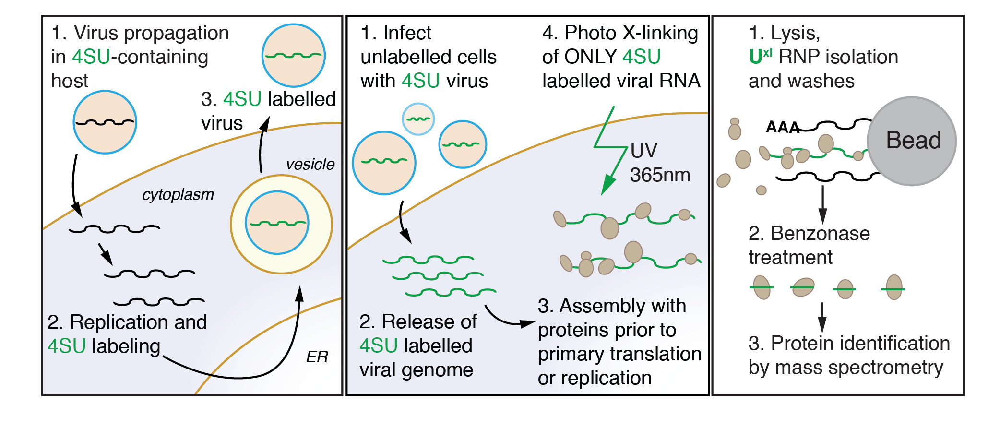

 

## Projects in the Lauring Lab

 
 

### 1. Using MI networks to study co-evolution in the H3N2 polymerase

Changes in the speed, fidelity, and drug resistance of RNA virus polymerases (including Influenza A) require multiple mutations. One example is that an initial mutation may confer drug resistance, but destabilize the protein- a second mutation is then required to maintain overall fitness. Co-evolution is one way to identify residues that may have a functional relationship. In this project, I have devised a method to use weighted Mutual Information to first identify co-evolving residue pairs. I then use a [network visualization](https://saraharcos.github.io/network) to identify higher-order interactions. A benefit of using networks is the ability to account for genetic hitchhiking with Influenza genes that are under strong selection (like HA or NA).

{width=50%}

 
 

### 2. Measuring changes in the speed and fidelity of the H3N2 polymerase

{width=50%}

The evolution of RNA virus polymerases is subject to a trade-off between speed and fidelity. As replicative speed increases, the polymerase makes more errors. While faster replication alone is obviously beneficial to the virus, the increased mutational load means that the faster speed comes at a cost.

We also know that RNA virus mutation rates are near the theoretical limit where the mutational burden becomes too high to support efficient replication. 

In the lab, I am working to determine the replicative speed and mutation rate of H3N2 strains covering 50 years of evolution using our viral competition assays and the GFP-based mutation rate assay developed by [Pauly et al](https://pubmed.ncbi.nlm.nih.gov/28598328/).

{width=105%}

 
 

---

## Projects in the Ascano Lab

 
 

### 1. VIR-CLASP

VIR-CLASP (Viral Cross-Linking And Solid-phase Purification) is a technique I co-developed to study host-pathogen interactions at the earliest stages of viral infection. This technique answers the question __What are the host RNA-binding proteins that directly interact with pre-replicated RNA virus genomes?__ The main trick of VIR-CLASP is to use the nucleoside analog 4SU to label RNA virus genomes, followed by infection into unlabeled host cells. This allows for the specific identification of protein interactions with incoming virion RNA, and not later stages of viral replication or host mRNAs.  Follow the links below to access all the data and code from our proteomics analysis of Chikungunya and Influenza A virus. 

[VIR-CLASP for Chikungunya Virus](https://github.com/saraharcos/CHIKV_VIRCLASP_Analysis)

[VIR-CLASP for Influenza A Virus](https://github.com/saraharcos/IAV_VIRCLASP_Analysis)

[Proteomics Data](https://www.ebi.ac.uk/pride/archive/projects/PXD015863)

[Publication](https://pubmed.ncbi.nlm.nih.gov/32380061/)

[Protocol](https://www.ncbi.nlm.nih.gov/pmc/articles/PMC8489533/)

 
 

### 2. Exploring m6A and YTHDF CLIP datasets

YTHDF proteins regulate RNA metabolism through recognition of the RNA modification N6-methyladenosine (m6A). While _in vitro_ biochemical data indicate that YTHDF proteins have a modest preference for methylated RNA over unmethylated RNA, _in vivo_ results indicate widespread binding of YTHDF proteins to unmethylated mRNAs and viral RNAs. This project aims to investigate the binding determinants and biological implications of YTHDF recognition of unmethylated RNAs.

[Exploring m6A and YTHDF CLIP datasets](https://github.com/saraharcos/m6A_Exploratory)
